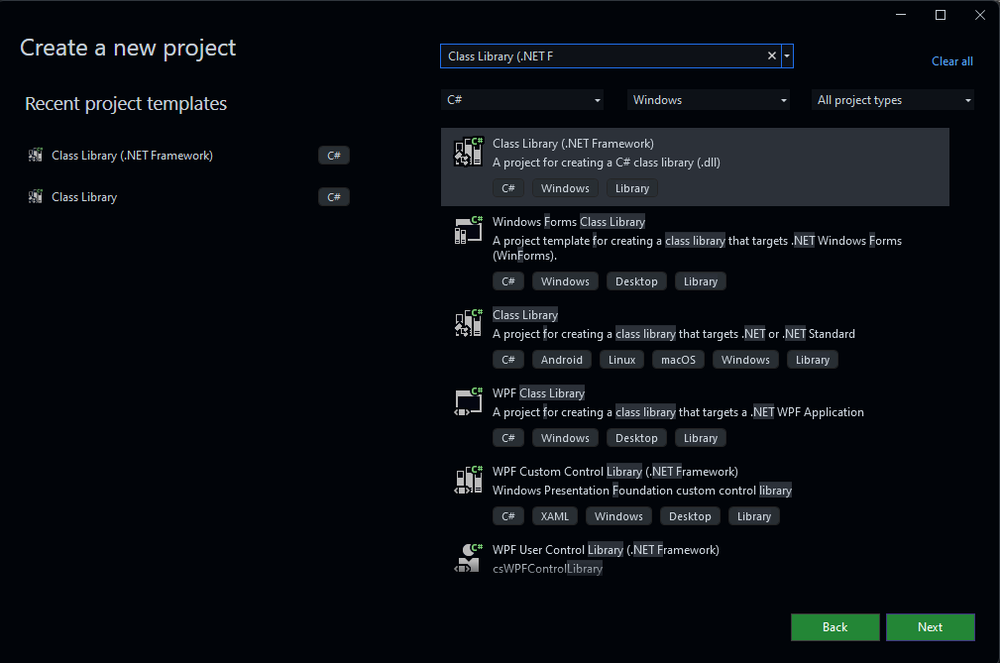

# UTILIZANDO VISUAL STUDIO PARA MODIFICAR LOS ARCHIVOS

A continuación se muestra una guía para utilizar Visual Studio de Microsoft para trabajar con el código fuente. Como el juego utiliza el motor de juego Unity y el lenguaje C#, se utilizará Visual Studio para trabajar con los archivos.

## INSTALANDO VISUAL STUDIO IDE

Podemos encontrar el instalador de [Visual Studio](https://visualstudio.microsoft.com/vs/) en la página de Microsoft.

## API de Unity

Para acceder al API de Unity, es necesario tener instalado la aplicación de [Unity Hub](https://unity.com/download).

## PASOS PARA INSTALAR LOS COMPONENTES DE UNITY EN VISUAL STUDIO IDE

1. Abre Visual Studio.
2. En la ventana de instalación, navega hasta la categoría de Gaming (2) y dale click a la que dice “Game Development with Unity”.

   

3. Después de los pasos de instalación, crea un nuevo proyecto con el template de “Class Library” para C#.
4. Escribe el nombre de tu mod en “Project name”.
5. Guarda el proyecto en otro directorio (no en el de mods).

### VISUAL STUDIO INSTALADO

Si ya tenías Visual Studio instalado, navega en tu workspace a Tools.
En tools, selecciona la opción de “Get tools and Features” para modificar la instalación y sigue los pasos de arriba.

### TIPO DE PROYECTO

El tipo de proyecto que se utilizará es “Class Library” para C#. Esto es para que el proyecto no tenga un punto de entrada y no se ejecute como un programa.



### AÑADIENDO REFERENCIAS

1. En la pestaña de solución, busca el tab de References (Add > Reference)
2. Click en Browse
3. Navega hasta

   ```bash
   <%STEAM%>\SteamApps\common\Cities_Skylines\Cities_Data\Managed
   ```

4. Selecciona los assemblies que quieras utilizar (recomendados: _ICities, UnityEngine, UnityEngine.UI, ColossalManaged, Assembly-CSharp)_

### AUTOMATIZANDO EL PROCESO

En este momento, cuando compilas tu mod, la DLL se colocará en la carpeta de tu espacio de trabajo donde creaste el proyecto.

1. Click en Proyecto y elige la Propiedades (en comando: Alt + Enter).
2. Selecciona “crear eventos” en el panel izquierdo.
3. Pega el siguiente comando y guarda.

   ```bash
   mkdir "%LOCALAPPDATA%\Colossal Order\Cities_Skylines\Addons\Mods\$(SolutionName)"

   del "%LOCALAPPDATA%\Colossal Order\Cities_Skylines\Addons\Mods\$(SolutionName)\$(TargetFileName)"

   xcopy /y "$(TargetPath)" "%LOCALAPPDATA%\Colossal Order\Cities_Skylines\Addons\Mods\$(SolutionName)"
   ```

## RECARGA AUTOMÁTICA DEL JUEGO

Para recargar el mod mientras el juego está corriendo, se debe cambiar las últimas dos líneas de **`AssemblyInfo.cs`**.

```csharp
[assembly: AssemblyVersion("1.0.*")]
// [assembly: AssemblyFileVersion("1.0.0.0")]
```

Al cambiar esto, la versión del ensamblado será diferente cada vez que compiles tu mod. Se recargará automáticamente tu mod y no tendrás que reiniciar el juego si haces un cambio en el mod.

<aside>
💡 En las versiones más reciente de Visual Studio, puede aparecer el mensaje de error “The specified version string contains wildcards, which are not compatible with determinism. Either remove wildcards from the version string, or disable determinism for this compilation”. El mensaje puede ser silenciado al etidar el archivo .csproj del proyecto.

</aside>

## COMPILAR EL PROYECTO

Para compilar el proyecto, usa el comando de `CTRL + SHIFT + B`. En caso de no haber hecho el paso “Automatizando el proceso”,\*\* guarda el archivo .dll en la carpeta de mods creada anteriormente.
