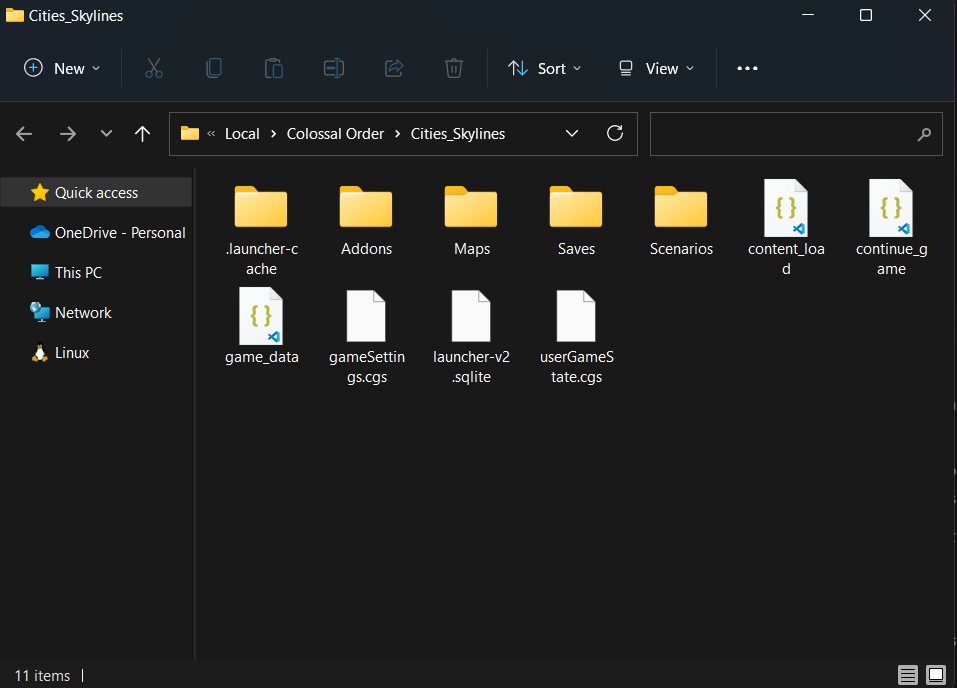
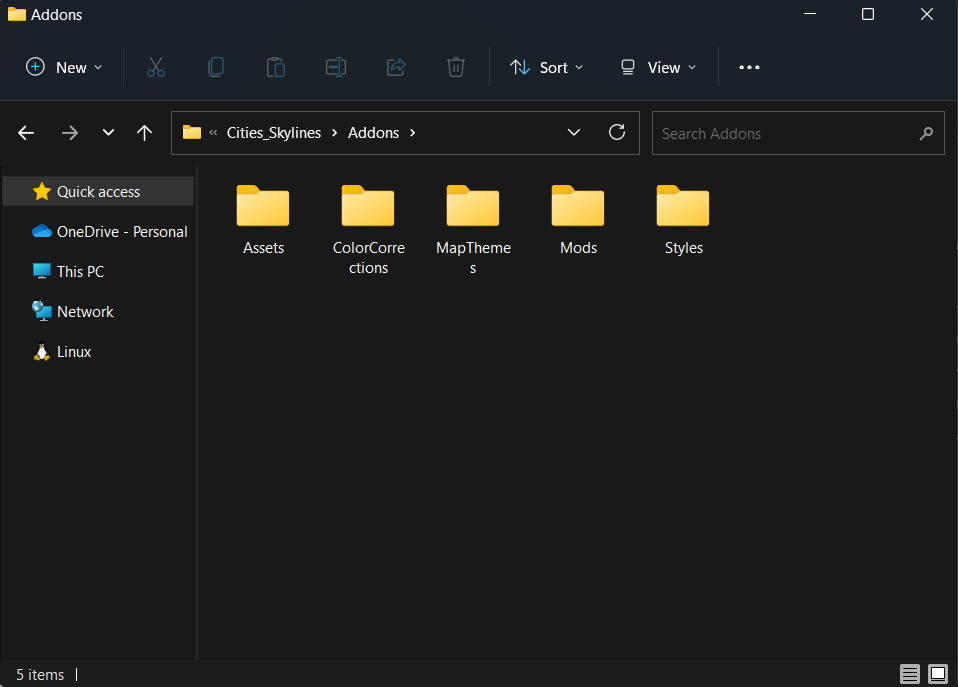

# WIKI: LAS BASES PARA MODIFICAR CITY SKYLINES

Date: October 7, 2022
Tags: Entrega, Wiki

# TIPOS DE MODS

Existen dos tipos de mods disponibles para el juego de City SKylines. EL primero de estos son los **mods básicos (basic mods)**. Estos utilizan el API del juego para modificar las propiedades y funcionalidad. El segundo tipo de mod son los **mods avanzados (advanced mods)**. Estos modifican el código fuente del juego.

# ESTRUCTURA DEL FOLDER DE CITY SKYLINES (DIRECTORIO)

## Steam

Con STEAM y su funcionalidad de workshop, permite descargar mods creados por la comudidad y los almacena en la siguiente carpeta

```csharp
<%STEAM%>\steamapps\workshop\content\255710
```

Los mods preinstalados de fabrica y creados se almacenan en la siguiente carpeta

```csharp
<%STEAM%>\steamapps\common\Cities_Skylines\Files\Mods
```

Por último, este folder contiene todos los assemblies necesarios para utilizar los APIs de Unity y de City Skylines.

```csharp
<%STEAM%>\steamapps\common\Cities_Skylines\Cities_Data\Managed
```

## Epic Games Store

Los archivos del juego son almacenados en la siguiente carpeta

```csharp
Epic\CitiesSkylines
```

Los mods preinstalados de fabrica y creados se almacenan en la siguiente carpeta

```csharp
Epic\CitiesSkylines\Files\Mods
```

Por último, este folder contiene todos los assemblies necesarios para utilizar los APIs de Unity y de City Skylines.

## ESTRUCTURA DE LOS SUBFOLDERES DE CITY SKYLINES

### Steam Folder Structure



### Epic Folder Structure


- **ADDONS**: para steam, la carpeta de Addons se descompone de la siguiente manera
  
  - **ASSETS**: contiene todos los assets guardados del editor de assets
  - **COLORCORRECTIONS**: permiten definir tablas de búsqueda de correcciones de color personalizas.
  - **IMPORT**: permite guardar assets personalizados.
  - **MAP EDITOR**
    - **BRUSHES**: permite almacenar texturas de pinceles personalizadas.
    - **HEIGHTMAPS**: permite implementar y almacenar mapas de terreno personalizadas por el usuario.
  - **MODS**: folder para guardar las modificaciones creadas por el usuario.
  - **STYLES**:
- **MAPS**: almacena todos los mapas generados del editor de mapas.
- **SAVES**: contiene todos los save files.
- **SCENARIOS**
- **SNAPSHOT**: contiene capturas tomadas del editor de mapa y assets editor con un nombre identificador para cada captura.
- **WORKSHOP STAGING AREA**: contenido de STEAM workshop se muestra aquí antes de subirlo (solo existen mientras sean necesarios).

<aside>
💡 Adicionalmente, en ciertas ocasiones podemos encontrar una carpeta llamada “temp” dentro de Addons utilizada por el juego.

</aside>

## TIPOS DE ARCHIVOS UTILIZADOS

- Utiliza un tipo de archivo interno llamados Colossal Raw Asset Package (.crp). Estos archivos funcionan como contenedores y encapsulan cualquier tipo de datos como save files, mapas, tablas de búsqueda de corrección de color o assets.

- Para importar activos, se utilizan extensiones estándar como png, jpg, bmp, tga, dds, raw, r8, r16 y tiff.

- Para geometría, modelos y meshes utiliza el tipo de archivo con extensión FBX.

# SETUP

## Steam

Para empezar a modificar el juego, primero se necesita crear una carpeta llamada mods dentro de addons.

```csharp
%LOCALAPPDATA%\Colossal Order\Cities_Skylines\Addons\Mods
```

## Epic Games Store

Para empezar a modificar el juego, primero se necesita crear una carpeta llamada mods dentro de files.

```csharp
Epic\CitiesSkylines\Files\Mods
```

Para ambos en esta carpeta, se deben crear más carpetas para almacenar cada mod que se desee crear.

```csharp
\Mods\YourModName\Source\YourModName.cs
```