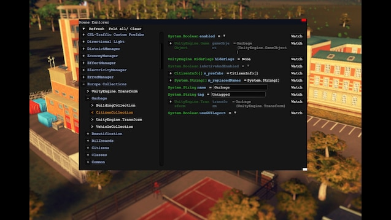
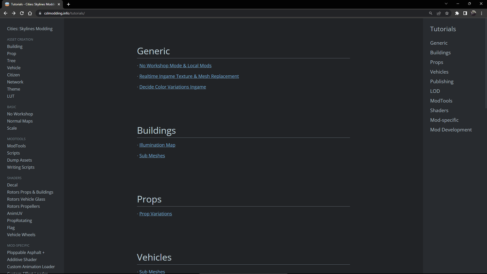
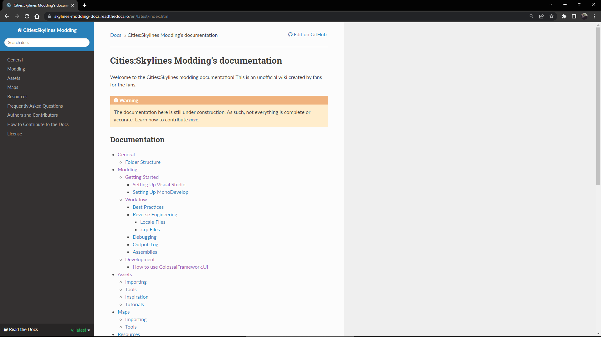
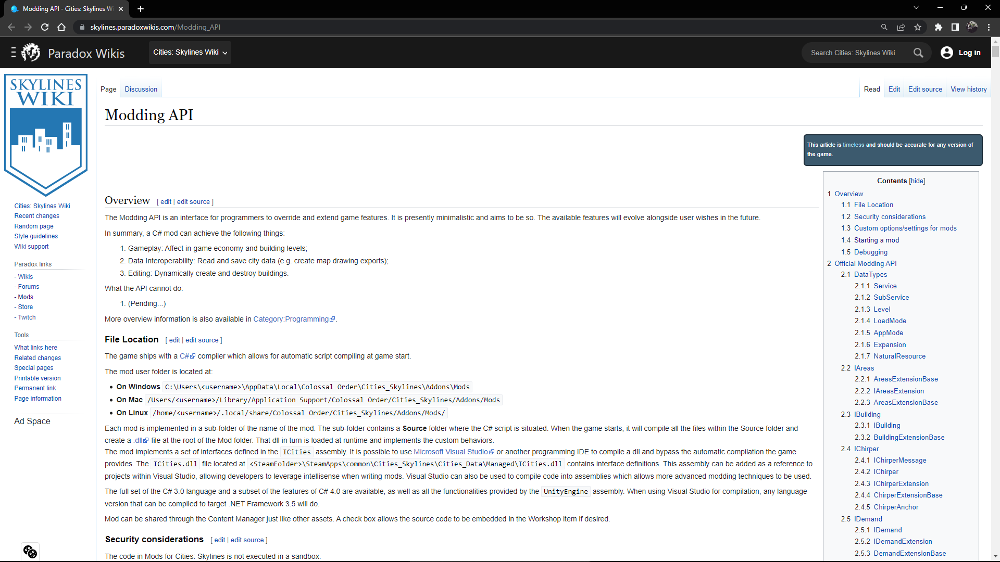
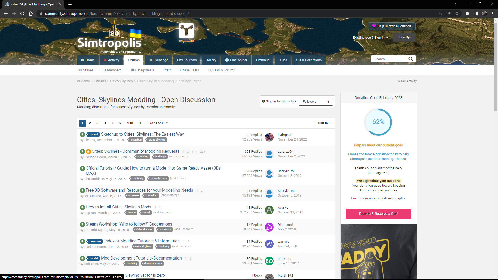

# HERRAMIENTAS ÚTILES PARA EL DESARROLLO DE MODS

## MODDING TOOLS

[Modding Tools](https://steamcommunity.com/sharedfiles/filedetails/?id=450877484&searchtext=ModTools) es una herramienta creada por BloodyPenguin, kian.zarrin y dymanoid.

ModTools es un visualizador de escenas en el juego y un conjunto de herramientas para
los autores de mods y recursos. ModTools no es un mod, sino una herramienta de
depuración para los autores de Mods y Activos.

## CLSMODDING

[CSLMODDING.INFO](https://cslmodding.info/tutorials/) es una página web que contiene
una gran cantidad de recursos para el desarrollo de mods.

## CITY SKLYINES MODDING DOCS

[Cities:Skylines Modding](https://skylines-modding-docs.readthedocs.io/en/latest/general/index.html) es una página web que contiene una documentación no oficial de la API de City Skylines.

## PARADOX INTERACTIVE DOCUMENTATION

[Paradox Interactive Documentation](https://skylines.paradoxwikis.com/Modding_API) es la documentación oficial de la API de City Skylines.

## CITIES SKYLINES MODDING OPEN DISCUSSION

 es una comunidad de modding de City Skylines. Esta comunidad cuenta con un foro de discusión.

