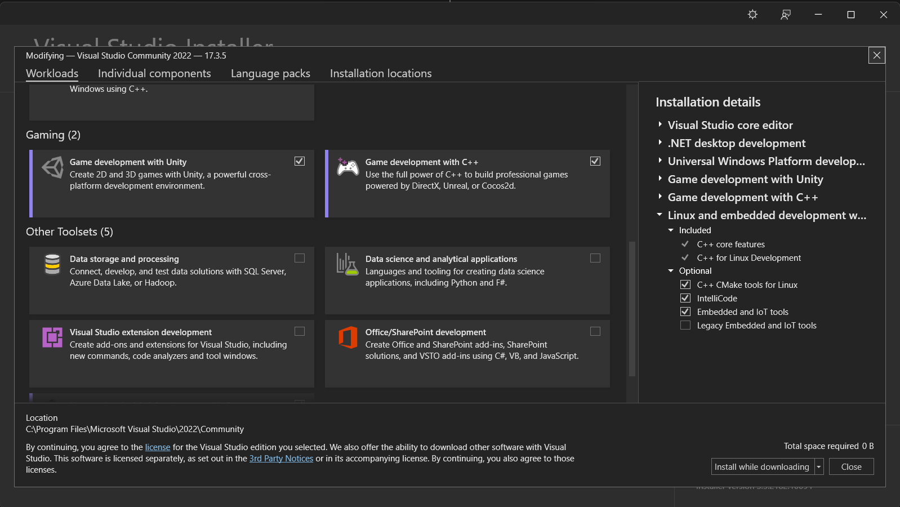

# WIKI: LAS BASES PARA MODIFICAR CITY SKYLINES

Date: October 7, 2022
Tags: Entrega, Wiki

# TIPOS DE MODS

Existen dos tipos de mods disponibles para el juego de City SKylines. EL primero de estos son los **mods básicos (basic mods)**. Estos utilizan el API del juego para modificar las propiedades y funcionalidad. El segundo tipo de mod son los **mods avanzados (advanced mods)**. Estos modifican el código fuente del juego.

# ESTRUCTURA DEL FOLDER DE CITY SKYLINES (DIRECTORIO)

## Steam

Con STEAM y su funcionalidad de workshop, permite descargar mods creados por la comudidad y los almacena en la siguiente carpeta

```csharp
<%STEAM%>\steamapps\workshop\content\255710
```

Los mods preinstalados de fabrica y creados se almacenan en la siguiente carpeta

```csharp
<%STEAM%>\steamapps\common\Cities_Skylines\Files\Mods
```

Por último, este folder contiene todos los assemblies necesarios para utilizar los APIs de Unity y de City Skylines.

```csharp
<%STEAM%>\steamapps\common\Cities_Skylines\Cities_Data\Managed
```

## Epic Games Store

Los archivos del juego son almacenados en la siguiente carpeta

```csharp
Epic\CitiesSkylines
```

Los mods preinstalados de fabrica y creados se almacenan en la siguiente carpeta

```csharp
Epic\CitiesSkylines\Files\Mods
```

Por último, este folder contiene todos los assemblies necesarios para utilizar los APIs de Unity y de City Skylines.

## ESTRUCTURA DE LOS SUBFOLDERES DE CITY SKYLINES

### Steam Folder Structure


### Epic Folder Structure


- **ADDONS**: para steam, la carpeta de Addons se descompone de la siguiente manera
  
  - **ASSETS**: contiene todos los assets guardados del editor de assets
  - **COLORCORRECTIONS**: permiten definir tablas de búsqueda de correcciones de color personalizas.
  - **IMPORT**: permite guardar assets personalizados.
  - **MAP EDITOR**
    - **BRUSHES**: permite almacenar texturas de pinceles personalizadas.
    - **HEIGHTMAPS**: permite implementar y almacenar mapas de terreno personalizadas por el usuario.
  - **MODS**: folder para guardar las modificaciones creadas por el usuario.
  - **STYLES**:
- **MAPS**: almacena todos los mapas generados del editor de mapas.
- **SAVES**: contiene todos los save files.
- **SCENARIOS**
- **SNAPSHOT**: contiene capturas tomadas del editor de mapa y assets editor con un nombre identificador para cada captura.
- **WORKSHOP STAGING AREA**: contenido de STEAM workshop se muestra aquí antes de subirlo (solo existen mientras sean necesarios).

<aside>
💡 Adicionalmente, en ciertas ocasiones podemos encontrar una carpeta llamada “temp” dentro de Addons utilizada por el juego.

</aside>

## TIPOS DE ARCHIVOS UTILIZADOS

- Utiliza un tipo de archivo interno llamados Colossal Raw Asset Package (.crp). Estos archivos funcionan como contenedores y encapsulan cualquier tipo de datos como save files, mapas, tablas de búsqueda de corrección de color o assets.

- Para importar activos, se utilizan extensiones estándar como png, jpg, bmp, tga, dds, raw, r8, r16 y tiff.

- Para geometría, modelos y meshes utiliza el tipo de archivo con extensión FBX.

# SETUP

## Steam

Para empezar a modificar el juego, primero se necesita crear una carpeta llamada mods dentro de addons.

```csharp
%LOCALAPPDATA%\Colossal Order\Cities_Skylines\Addons\Mods
```

## Epic Games Store

Para empezar a modificar el juego, primero se necesita crear una carpeta llamada mods dentro de files.

```csharp
Epic\CitiesSkylines\Files\Mods
```

Para ambos en esta carpeta, se deben crear más carpetas para almacenar cada mod que se desee crear.

```csharp
\Mods\YourModName\Source\YourModName.cs
```

## UTILIZANDO VISUAL STUDIO PARA MODIFICAR LOS ARCHIVOS

A continuación se muestra una guía para utilizar Visual Studio de Microsoft para trabajar con el código fuente. Como el juego utiliza el motor de juego Unity y el lenguaje C#, se utilizará Visual Studio para trabajar con los archivos.

### INSTALANDO VISUAL STUDIO IDE

Podemos encontrar el instalador de Visual Studio Community en la página de Microsoft.

[Descargar Visual Studio Tools: instalación gratuita para Windows, Mac, Linux](https://visualstudio.microsoft.com/es/downloads/)

## API de Unity

Para acceder al API de Unity, es necesario tener instalado la aplicación de Unity Hub.

## PASOS PARA INSTALAR LOS COMPONENTES DE UNITY EN VISUAL STUDIO IDE

1. Abre Visual Studio.
2. En la ventana de instalación, navega hasta la categoría de Gaming (2) y dale click a la que dice “Game Development with Unity”.

   

3. Después de los pasos de instalación, crea un nuevo proyecto con el template de “Class Library” para C#.
4. Escribe el nombre de tu mod en “Project name”.
5. Guarda el proyecto en otro directorio (no en el de mods).

### VISUAL STUDIO INSTALADO

Si ya tenías Visual Studio instalado, navega en tu workspace a Tools.
En tools, selecciona la opción de “Get tools and Features” para modificar la instalación y sigue los pasos de arriba.

### AÑADIENDO REFERENCIAS

1. En la pestaña de solución, busca el tab de References (Add > Reference)
2. Click en Browse
3. Navega hasta

   ```csharp
   <%STEAM%>\SteamApps\common\Cities_Skylines\Cities_Data\Managed
   ```

4. Selecciona los assemblies que quieras utilizar (recomendados: _ICities, UnityEngine, UnityEngine.UI, ColossalManaged, Assembly-CSharp)_

### AUTOMATIZANDO EL PROCESO

En este momento, cuando compilas tu mod, la DLL se colocará en la carpeta de tu espacio de trabajo donde creaste el proyecto.

1. Click en Proyecto y elige la Propiedades (en comando: Alt + Enter).
2. Selecciona “crear eventos” en el panel izquierdo.
3. Pega el siguiente comando y guarda.

   ```csharp
   mkdir "%LOCALAPPDATA%\Colossal Order\Cities_Skylines\Addons\Mods\$(SolutionName)"

   del "%LOCALAPPDATA%\Colossal Order\Cities_Skylines\Addons\Mods\$(SolutionName)\$(TargetFileName)"

   xcopy /y "$(TargetPath)" "%LOCALAPPDATA%\Colossal Order\Cities_Skylines\Addons\Mods\$(SolutionName)"
   ```

## RECARGA AUTOMÁTICA DEL JUEGO

Para recargar el mod mientras el juego está corriendo, se debe cambiar las últimas dos líneas de **`AssemblyInfo.cs`**.

```csharp
[assembly: AssemblyVersion("1.0.*")]
// [assembly: AssemblyFileVersion("1.0.0.0")]
```

Al cambiar esto, la versión del ensamblado será diferente cada vez que compiles tu mod. Se recargará automáticamente tu mod y no tendrás que reiniciar el juego si haces un cambio en el mod.

<aside>
💡 En las versiones más reciente de Visual Studio, puede aparecer el mensaje de error “The specified version string contains wildcards, which are not compatible with determinism. Either remove wildcards from the version string, or disable determinism for this compilation”. El mensaje puede ser silenciado al etidar el archivo .csproj del proyecto.

</aside>

## COMPILAR EL PROYECTO

Para compilar el proyecto, usa el comando de `CTRL + SHIFT + B`. En caso de no haber hecho el paso “Automatizando el proceso”,\*\* guarda el archivo .dll en la carpeta de mods creada anteriormente.
