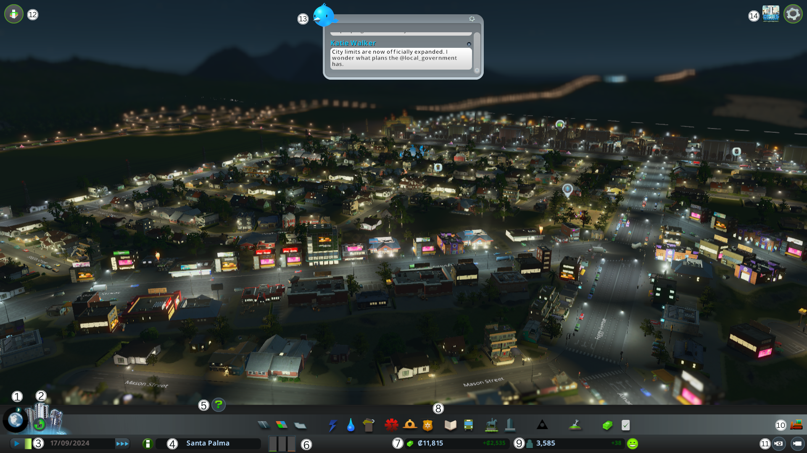

# WIKI: COMO JUGAR CITY SKYLINES Y SOBREVIVIR EN EL INTENTO

Date: September 26, 2022
Tags: Guía, Primera entrega

## REQUERIMIENTOS PARA CORRER EL JUEGO

Los requisitos para correr el juego fueron extraídos de Steam. Se utilizará la plataforma de Steam ya que permite modificar el juego con facilidad. A continuación se muestran los requisitos de forma simplificada. 

|  | MINIMUM | RECOMMENDED |
| --- | --- | --- |
| OS | Windows 7 64 bit, Windows 8.1 64 bit, Windows 10 Home 64 bit | Windows 10 Home 64 bit |
| Procesador | Intel Core i7 930, AMD FX 6350 | Intel Core i7 2700k, AMD Ryzen 7 2700X |
| Memoria | 8 GB de RAM | 16 GB de RAM |
| Graficos | Nvidia GeForce GTS 450 (1 GB), AMD R7 250 (2 GB), Intel Iris Xe G7 (Tiger lake) | Nvidia GeForceGTX 580 (1.5 GB), AMD Radeon RX 560 (4 GB) |
| DirectX | Version 9.0c | Version 11 |
| Red | Conexion de banda ancha de internet | Conexion de banda ancha de internet |
| Almacenamiento | 4 GB de espacio disponible | 4 GB de espacio disponible |

## MECÁNICAS BÁSICAS

Primero se describen los controles del juego. 

### CONTROLES EN EL MOUSE

| DESCRIPCIÓN  | WINDOWS | DESCRIPCIÓN  | WINDOWS |
| --- | --- | --- | --- |
| Moviendo el puntero | Mouse / Trackpad motion | Zoom de la cámara  | Scroll Wheel (arriba = zoom in, abajo = zoom out) |
| Seleccionar item / activar botón  | Click izquierdo | Inclinación de la camara  | Botón central del mouse + movimiento arriba / abajo |
| Controlar la cámara  | Scroll | Cancelar la selección  | Click derecho |
| Rotar la cámara  | Botón central del mouse + movimiento izquierda / derecha | Construir una calle | Click izquierdo + movimiento de mouse + click izquierdos |

### CONTROLES EN EL TECLADOS

| DESCRIPCIÓN | WINDOWS | DESCRIPCIÓN | WINDOWS |
| --- | --- | --- | --- |
| Control de la cámara  | WASD | Herramienta de zonificación residencial (alto) | 5 |
| Rotación de la cámara  | Q/E | Herramienta de zonificación comercial (bajo) | 6 |
| Inclinación de la cámara  | HOME/END | Herramienta de zonificación comercial (alto) | 7 |
| Zoom de la camara | Z/X | Herramienta de zonificación industrial (bajo) | 8 |
| Salir del menú o de la herramienta | ESC | Herramienta de zonificación industrial (alto) | 9 |
| Pausar el juego | SPACE BAR | Herramienta de deszonificación | 0 |
| Velocidad normal | 1 | Herramienta de excavación | B |
| Velocidad rápida | 2 | F11 (Captura de pantalla de Steam F12) | F11 |
| Velocidad super rápida | 3 | Menú de pausa | ESC |
| Herramienta de zonificación residencial (bajo) | 4 |  |  |

### INTEFAZ DEL JUEGO

1. **Areas**: permite alternar entre la vista de áreas y vistas del juego. 
2. **Milestones (Metas)**: permite ver los requisitos para desbloquear el siguiente nivel de la ciudad. Permite navegar hacia atrás y adelante con los íconos de flechas al lado de la barra de progreso. 
3. **Tiempo de juego**: muestra el tiempo transcurrido de la partida. La velocidad predeterminada de una semana es de un minuto. Puedes ver la fecha actual en el juego, así como ajustar con clicks la velocidad del juego. 
4. **Nombre de la ciudad**: de forma compacta muestra el nombre de la ciudad. Al darle click, muestra más información de la ciudad como el número total de habitantes, el número de casas, el número de trabajadores y el número de turistas. Además, muestra el número total de adultos, adolescentes, adulto joven, adultos y personas mayores. Así como el nivel de las zonas (residencial, comercial e industrial), el valor medio de la tierra, el porcentaje de atractivo de la ciudad y las políticas activas. 
5. **Advisor**: permite altenar la visibilidad del asesor. El panel muestra información y consejos sobre la herramienta o características activas cuando está visible. 
6. **Demandas de zonificación**: divide las demandas de zonificación en tres columnas. La columna de color verde representa las zonas residenciales, la de color azul representa las zonas comerciales y la de color naranja representa las zonas industriales. 
    
    La industria necesita de trabajadores y clientes, los ciudadanos necesitan tiendas y comestibles para cumplir con sus necesidades del día a día, y las empresas necesitan clientes para comprar sus productos servicios. 
    
    <aside>
    💡 Un desequilibrio en la zonificación conducirá al desempleo, la bancarrota y el descontento general.
    
    </aside>
    
    Esto conducirá al abandono de edificios por parte de los ciudadanos y/o al crecimiento negativo de la población. 
    
    <aside>
    💡 Cuando más completa sea la zonificación es la barra de demanda, mayor es la necesidad de zonas de ese tipo.
    
    </aside>
    
7. **Balance**: muestra los fondos disponibles y el saldo presupuestario semanal de ingresos. 
8. **Paneles de servicio de calidad**: contiene todas las herramientas necesarias para crear la ciudad y proveer de servicios a los ciudadanos. 
    1. **Carreteras**: utilizado para crear carreteras.
    2. **Zonificación**: permite configurar y eliminar zonas. 
    3. **Distritos**: sirve para administrar los distritos y sus especializaciones industriales.
    4. **Electricidad**: permite construir líneas eléctricas y centrales eléctricas.
    5. **Servicios de Agua**: utilizado para proporcionar a la ciudad agua potable y los medios para eliminar las aguas residuales.
    6. **Servicios de recolección de basura**: permite administrar la eliminación de basura.
    7. **Atención médica**: proporciona servicios médicos a la ciudad. También permite honrar a los muertos. 
    8. **Departamento de bomberos**: utilizado para gestionar la seguridad contra incendios.
    9. **Departamento de policías**: utilizado para administrar las tasas de crimen. 
    10. **Educación**: provee educación a los ciudadanos. 
    11. **Transporte público**: permite gestionar diferentes transportes públicos.
    12. **Decoración**: permite decorar y embellecer la ciudad a través de decoraciones, parques, entre otros.
    13. **Edificios únicos**: puede seleccionar y colocar edificios únicos disponibles. 
    14. **Monumentos**: son los servicios urbanos por excelencia.
    15. **Economía**: permite administrar la economía, así como 
    16. **Políticas**: permite administrar las políticas de la ciudad / distrito.
9. **Población y felicidad**: el contador de población muestra el número de ciudadanos que viven en la ciudad y la tendencia actual de la población. 
    
    Al lado del contador se encuentra el ícono de felicidad que indica el bienestar de los ciudadanos. 
    
10. **Bulldozer**: puede ser activado y desactivado desde el botón. Cuando el modo está activo, otras herramientas y paneles están deshabilitados. Además permite demoler carreteras, edificios y otras infraestructuras al darles click. 
11. **Modo de cámara libre**: permite ser activado y desactivado. Cuando el modo está activo, permite mover y controlar la vista sin restricciones. La interfaz del usuario se esconde mientras el modo esté activo. Para salir del modo, presione la tecla ESC. 
12. **Vistas de información**: ofrece información relevante sobre los diferentes servicios, recursos y problemas con  la ciudad. La vista del mapa cambia de acuerdo con el item seleccionado. Dentro de cada item, pueden existir diferentes pestañas de información para cada servicio. 
    
    Las vistas de información son prácticas no solo para rastrear la cobertura de servicio, agua y electricidad en el mapa, sino también para
    predecir posibles problemas o necesidades crecientes en la ciudad.
    
13. **Chirper**: es un estilo de “red social” dentro del juego. Muestra los “Chirps” de los ciudadanos. Muestra información sobre eventos y acontecimientos de la ciudad, pero también pueden reflejar el estado de ánimo de los ciudadanos y opiniones.
    
    Esta herramienta permite dar al jugador algunas pistas valiosas sobre el bienestar de los ciudadanos. 
    
14. **Pausar el menú**: al abrir el menú de opcinoes, se pausa el juego y se despliegan las siguientes opciones: 
    1. **Guardar el juego**: sobreescribe el save file anterior o crea uno nuevo. 
    2. **Cargar el juego**: permite cargar una partida guardada. 
    3. **Opciones**: muestras las configuraciones para gráficos, audios y del juego. 
    4. **Salir**: sale del juego y vuelve al menú principal.

## REGLAS BÁSICAS

En general, el juego de City Skylines es muy sencillo. Si sigues los indicadores te facilitará la construcción y manejo de los servicios y de la ciudad en general.

<aside>
💡 Al ser un simulador, no tiene un patrón de juego definido, si no que el usuario define la forma en que desea jugarlo. Lo único importante es que con el presupuesto inicial, inicia despacio para convertir los gastos en mayor ingreso.

</aside>

**Algunos consejos que podría dar para mejorar la experiencia del juego son:** 

1. Usa los distritos a tu favor
2. Proporcionar más de una ruta a la autopista (highway)
3. Las rotondas valen la pena
4. Conectar cosas con caminos
5. 12 porciento es la tasa impositiva perfecta
6. Presupuestos de servicio más bajos al principio
7. Plan para mejora de carreteras
8. Planificar el diseño de la ciudad con cuidado
9. Verificar los recursos tempranos
10. Mantener la industria separada de otras zonas
